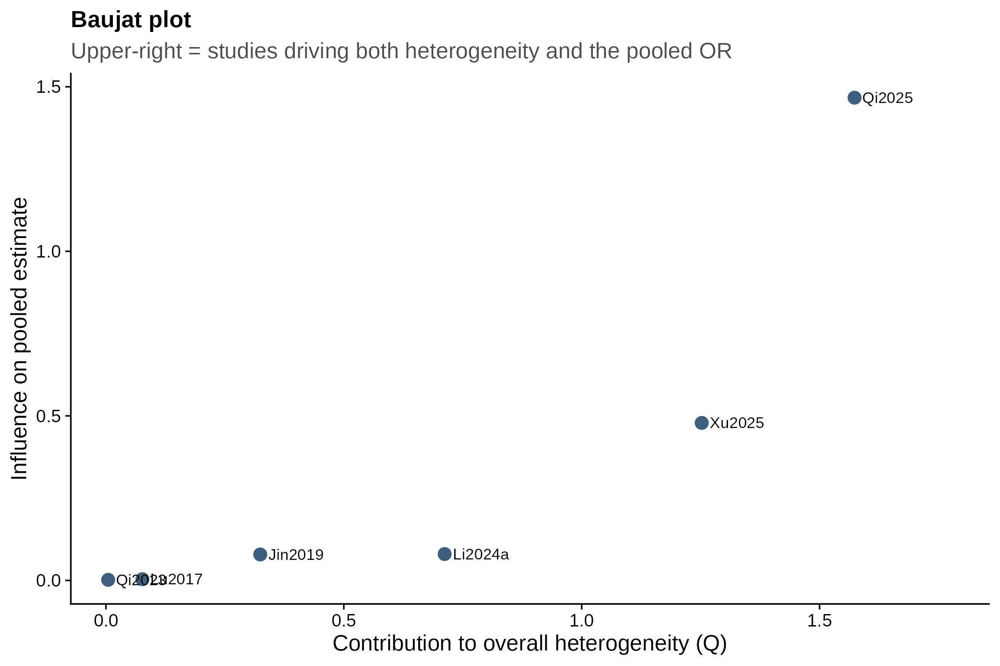
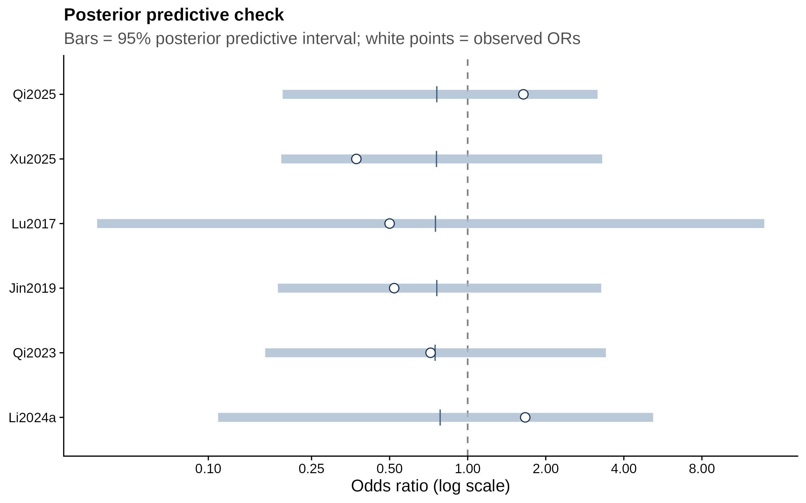

```{r}
#| label: setup
#| message: false
#| warning: false
source("analysis/meta_helpers.R")
ma <- load_ma()
bm_primary <- fit_bm(dplyr::filter(ma, tier == "primary"))
bm_sens    <- fit_bm(ma)

# 95% prediction interval (OR) and pooled clinical response, for the summary below
pred <- exp(bm_sens$qposterior(mu.p = c(0.025, 0.975), predict = TRUE))  # analytic 95% prediction interval
resp <- tibble::tribble(
  ~study,    ~e_comb, ~n_comb, ~e_ref, ~n_ref, ~confounded,
  "Jin2019",      24,      35,     54,     91, FALSE,
  "Qi2023",       33,      43,     11,     21, FALSE,
  "Li2024a",      20,      20,     12,     18, TRUE)
respE <- escalc(measure = "OR", ai = e_comb, n1i = n_comb, ci = e_ref, n2i = n_ref,
                data = resp, slab = study)
respE$sei <- sqrt(respE$vi)
bm_resp_clean <- fit_bm(dplyr::filter(respE, !confounded))
```

::: {.callout-note}
This report was generated using AI under general human direction. At the time of
generation, the contents have not been comprehensively reviewed by a human analyst.
:::

## Summary of findings

In source-verified, HIV-negative PCP cohorts, adjunctive echinocandin plus TMP-SMX shows
a **possible but inconclusive** mortality benefit versus TMP-SMX monotherapy. The
sensitivity-analysis pooled odds ratio is `{r} fmt(bm_sens)` (posterior probability of
benefit `{r} sprintf("%.0f%%", 100 * bm_sens$pposterior(mu = 0))`), and the primary
analysis is `{r} fmt(bm_primary)`. The [frequentist](frequentist.qmd) random-effects
estimate (OR 0.75, 95% CI 0.42–1.36) agrees closely, as does an independent
[random-walk Metropolis refit](model-fit.qmd).

## Beyond mortality

Two further readings sharpen the interpretation. First, the **95% prediction interval** for
the odds ratio is `{r} sprintf("%.2f\u2013%.2f", pred[1], pred[2])`: even though the pooled
estimate leans protective, the true effect in a new setting could plausibly range from a
substantial mortality reduction to a doubling of the odds of death. Second, for the
secondary outcome of **clinical response**, the pooled odds ratio favours combination
therapy (`{r} fmt(bm_resp_clean)`, excluding the confounded Li2024a) and is directionally
consistent with Yang et al.'s reported response benefit — but, like mortality, its credible
interval still includes no effect. See the
[Bayesian results](bayesian.qmd#secondary-outcome-clinical-response) page for details.

## What supports the estimate

- **Consistency across frameworks.** Frequentist REML, semi-analytic Bayesian, and MCMC
  all land at OR ≈ 0.75–0.78 with intervals crossing 1.
- **Robust to priors.** The pooled estimate barely moves (0.75–0.77) across seven prior
  specifications; only interval width responds to the heterogeneity prior.

## What limits it

- **Small, observational evidence base.** Six studies, all non-randomised, at
  [serious risk of bias](risk-of-bias.qmd) from confounding by indication.
- **One influential study.** Removing Xu2025 moves the pool to the null (OR ≈ 0.94);
  removing Qi2025 strengthens it (≈ 0.59). See [sensitivity](sensitivity.qmd).
- **Confounded and heterogeneous.** Li2024a bundles caspofungin with corticosteroid and a
  lower TMP dose; mortality timepoints and treatment timing vary across studies.
- **Incomplete corpus.** Seven studies included by Yang et al. (2026) could not be
  retrieved — mostly Chinese-language papers and theses (CNKI/Wanfang); one (Wang-ZG-2019)
  was obtained and found ineligible (single-arm). Their absence limits power and may
  introduce language/selection bias.

## Model adequacy and influence

The random-effects model is an adequate description of the six studies: every observed odds
ratio falls within its posterior predictive interval, and the modelled heterogeneity matches
the data (omnibus Cochran's Q posterior predictive *p* = 0.40). The residual fragility comes
from two influential studies pulling in opposite directions rather than from a poorly fitting
model. Full diagnostics are on the [goodness-of-fit](goodness-of-fit.qmd) page.

{width=75%}

{width=75%}

## Certainty of evidence (GRADE)

Applying GRADE to the primary outcome, all-cause mortality. As a body of **non-randomised**
evidence, certainty starts at *low* and is then rated across the five domains below.

```{r}
#| label: grade-sof
p_ctrl <- sum(ma$e_ref) / sum(ma$n_ref)
orv <- or_ci(bm_sens)
risk_from_or <- function(p, or) { o <- p / (1 - p) * or; o / (1 + o) }
tibble::tibble(
  Field = c("Outcome", "Participants (studies)", "Relative effect (OR)",
            "Assumed risk, monotherapy", "Corresponding risk, combination (95% CrI)",
            "Certainty"),
  Value = c(
    "All-cause mortality (in-hospital / ~30-day)",
    sprintf("%d (6 observational studies)", sum(ma$n_comb + ma$n_ref)),
    fmt(bm_sens),
    sprintf("%.0f per 1000", p_ctrl * 1000),
    sprintf("%.0f per 1000 (%.0f to %.0f)",
            risk_from_or(p_ctrl, orv[1]) * 1000,
            risk_from_or(p_ctrl, orv[2]) * 1000,
            risk_from_or(p_ctrl, orv[3]) * 1000),
    "\u2295\u25cb\u25cb\u25cb Very low")
) |> knitr::kable()
```

| GRADE domain | Judgment | Rationale |
|---|---|---|
| Risk of bias | Serious (−1) | All studies non-randomised; confounding by indication; Li2024a critical (bundled co-interventions). |
| Inconsistency | Not serious | Credible intervals overlap and the direction is largely consistent; moderate I² (42%) is attributable to one influential study. |
| Indirectness | Not serious | Population, intervention, comparator and outcome match the review question directly. |
| Imprecision | Serious (−1) | Pooled CrI (0.43–1.37) spans meaningful benefit and harm; only 473 participants; wide prediction interval. |
| Publication bias | Suspected | Seven eligible studies (mostly Chinese-language) could not be retrieved; too few studies to test formally. |

**Overall certainty: very low (⊕◯◯◯).** We are very uncertain whether adjunctive echinocandin
reduces all-cause mortality in HIV-negative PCP. This rating is preliminary and should be
finalised after dual ROBINS-I assessment.

## Relation to the wider literature

Our result partly overlaps with Yang et al. (2026): their overall estimate is also null
(OR 0.93), and their protective signal is confined to the *initial-therapy* subgroup
(OR 0.50). Crucially, **we could not reproduce timing as an effect modifier**: within our six
studies the initial and mixed subgroups are nearly identical (OR ≈ 0.70 vs 0.74) and a formal
moderator test is null (Q~M~(1) = 0.00, p = 0.99; see
[sensitivity](sensitivity.qmd#formal-timing-test-and-comparison-with-yang-et-al-2026)). The
apparent timing alignment reflects which studies are labelled "initial" rather than a genuine
subgroup effect, and a direct significance test between the analyses is precluded by the ~9
studies they share. Yang's extraction also contains errors we identified during verification
(their Qi2025 numbers are from the ventilated subgroup; their "Wang 2019" treats a single-arm
case series as a two-arm comparison), so it is a useful comparator rather than a ground truth.

## Bottom line

Adjunctive echinocandin **may** reduce mortality in HIV-negative PCP, but the current
evidence is too small, too observational, and too incomplete to be conclusive. Priorities before drawing a firm conclusion: complete dual
human verification and formal ROBINS-I assessment, retrieve the missing Chinese-language
studies, and — ultimately — randomized evidence.
