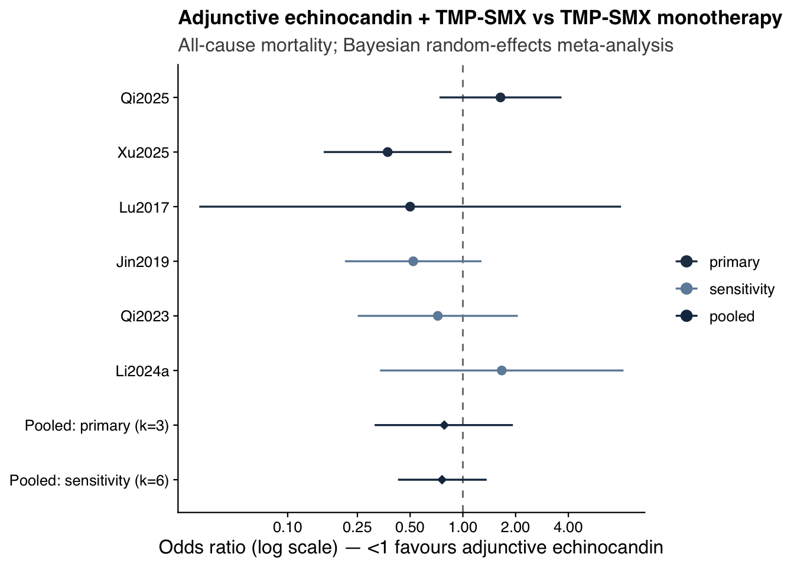
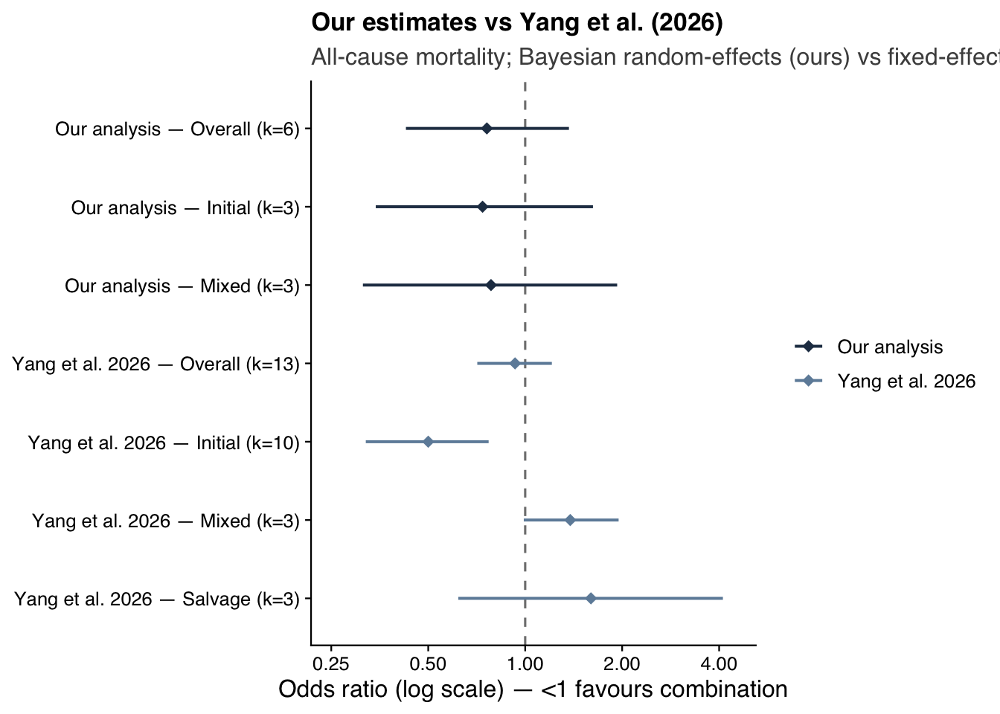
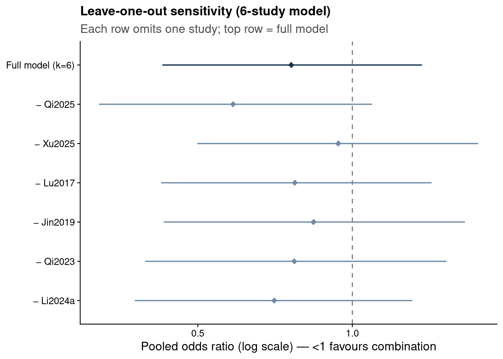

::: {.cell}

```{.r .cell-code}
library(tidyverse)
```

::: {.cell-output .cell-output-stderr}

```
Warning: package 'ggplot2' was built under R version 4.5.2
```


:::

::: {.cell-output .cell-output-stderr}

```
Warning: package 'tibble' was built under R version 4.5.2
```


:::

::: {.cell-output .cell-output-stderr}

```
Warning: package 'tidyr' was built under R version 4.5.2
```


:::

::: {.cell-output .cell-output-stderr}

```
Warning: package 'readr' was built under R version 4.5.2
```


:::

::: {.cell-output .cell-output-stderr}

```
Warning: package 'purrr' was built under R version 4.5.2
```


:::

::: {.cell-output .cell-output-stderr}

```
Warning: package 'dplyr' was built under R version 4.5.2
```


:::

::: {.cell-output .cell-output-stderr}

```
Warning: package 'lubridate' was built under R version 4.5.2
```


:::

::: {.cell-output .cell-output-stderr}

```
── Attaching core tidyverse packages ──────────────────────── tidyverse 2.0.0 ──
✔ dplyr     1.2.1     ✔ readr     2.2.0
✔ forcats   1.0.1     ✔ stringr   1.6.0
✔ ggplot2   4.0.3     ✔ tibble    3.3.1
✔ lubridate 1.9.5     ✔ tidyr     1.3.2
✔ purrr     1.2.2     
── Conflicts ────────────────────────────────────────── tidyverse_conflicts() ──
✖ dplyr::filter() masks stats::filter()
✖ dplyr::lag()    masks stats::lag()
ℹ Use the conflicted package (<http://conflicted.r-lib.org/>) to force all conflicts to become errors
```


:::

```{.r .cell-code}
library(metafor)
```

::: {.cell-output .cell-output-stderr}

```
Warning: package 'metafor' was built under R version 4.5.2
```


:::

::: {.cell-output .cell-output-stderr}

```
Loading required package: Matrix
```


:::

::: {.cell-output .cell-output-stderr}

```
Warning: package 'Matrix' was built under R version 4.5.2
```


:::

::: {.cell-output .cell-output-stderr}

```

Attaching package: 'Matrix'

The following objects are masked from 'package:tidyr':

    expand, pack, unpack

Loading required package: metadat
```


:::

::: {.cell-output .cell-output-stderr}

```
Warning: package 'metadat' was built under R version 4.5.2
```


:::

::: {.cell-output .cell-output-stderr}

```
Loading required package: numDeriv

Loading the 'metafor' package (version 5.0-1). For an
introduction to the package please type: help(metafor)
```


:::

```{.r .cell-code}
library(bayesmeta)
```

::: {.cell-output .cell-output-stderr}

```
Loading required package: forestplot
```


:::

::: {.cell-output .cell-output-stderr}

```
Warning: package 'forestplot' was built under R version 4.5.2
```


:::

::: {.cell-output .cell-output-stderr}

```
Loading required package: grid
Loading required package: checkmate
```


:::

::: {.cell-output .cell-output-stderr}

```
Warning: package 'checkmate' was built under R version 4.5.2
```


:::

::: {.cell-output .cell-output-stderr}

```
Loading required package: abind
Loading required package: mvtnorm
```


:::

::: {.cell-output .cell-output-stderr}

```
Warning: package 'mvtnorm' was built under R version 4.5.2
```


:::

::: {.cell-output .cell-output-stderr}

```

Attaching package: 'bayesmeta'

The following object is masked from 'package:stats':

    convolve
```


:::

```{.r .cell-code}
source("analysis/jama_style.R")
```
:::


::: {.cell}

```{.r .cell-code}
# Verified analysis dataset (source-checked counts). One row per study:
# combination (echinocandin) arm events/N and reference (monotherapy) arm events/N.
ma <- read_csv("analysis/pcp_primary_meta_dataset.csv", show_col_types = FALSE) |>
  select(study, tier, timing, timepoint, e_comb, n_comb, e_ref, n_ref)

# Recompute per-study log odds ratios from the raw counts (self-contained).
ma <- escalc(measure = "OR",
             ai = e_comb, n1i = n_comb,   # combination (echinocandin) arm
             ci = e_ref,  n2i = n_ref,    # reference (monotherapy) arm
             data = ma, slab = study) |>
  mutate(sei = sqrt(vi), OR = exp(yi))
```
:::


::: {.cell}

```{.r .cell-code}
# Bayesian random-effects (normal-normal) meta-analysis with weakly informative
# priors: mu ~ N(0, 1.5) on the log-OR; tau ~ half-normal(0.5).
fit_bm <- function(d) {
  bayesmeta(y = d$yi, sigma = d$sei, labels = d$study,
            mu.prior  = c(mean = 0, sd = 1.5),
            tau.prior = function(t) dhalfnormal(t, scale = 0.5))
}
or_ci <- function(bm) c(exp(bm$summary["median", "mu"]),
                        exp(bm$summary["95% lower", "mu"]),
                        exp(bm$summary["95% upper", "mu"]))
fmt   <- function(bm) { v <- or_ci(bm); sprintf("%.2f (95%% CrI %.2f\u2013%.2f)", v[1], v[2], v[3]) }
plt1  <- function(bm) bm$pposterior(mu = 0)   # P(OR < 1 | data)

bm_primary <- fit_bm(filter(ma, tier == "primary"))      # k = 3
bm_sens    <- fit_bm(ma)                                  # k = 6
bm_initial <- fit_bm(filter(ma, timing == "initial"))    # Jin2019, Qi2023, Li2024a
bm_mixed   <- fit_bm(filter(ma, timing == "mixed"))       # Qi2025, Xu2025, Lu2017
```
:::


# Background and objective

This review addresses the PROSPERO-registered question of the comparative effectiveness of combination and adjunctive regimens versus standard monotherapy for *Pneumocystis jirovecii* pneumonia (PCP/PJP) in HIV-negative / immunocompromised adults. The most coherent contrast supported by the currently available data is **adjunctive echinocandin/caspofungin plus trimethoprim-sulfamethoxazole (TMP-SMX) versus TMP-SMX monotherapy**, with all-cause mortality (30-day and/or in-hospital) as the primary outcome, expressed as an odds ratio (OR) with 95% credible intervals (CrI).

# Methods

## Data source and verification

Study-level data were extracted from a structured extraction database (machine first-pass) and then **verified against the source full texts** before analysis. Verification changed the analytic set in three material ways:

- **Tian2020 was excluded**: it is an HIV-*positive* cohort (published in *HIV Medicine*), which violates the HIV-negative inclusion criterion. The machine draft had misclassified it.
- **Qi2025 and Yanmeng2026 are the same PUMCH cohort** (byte-identical source); one copy was retained. The full-cohort comparison (Table 4: 18/35 caspofungin vs 31/79 monotherapy) was used, not the mechanically-ventilated subgroup.
- **Li2024a was retained but flagged confounded**: its combination arm bundles caspofungin with a corticosteroid and a lower TMP dose, so it cannot isolate an echinocandin effect. It sits in the sensitivity tier only.

The **primary** analysis comprises the studies reporting in-hospital or \~30-day mortality (Qi2025, Xu2025, Lu2017); the **sensitivity** analysis adds studies reporting longer-timepoint mortality (Jin2019, Qi2023, Li2024a).

## Statistical model

We fitted a Bayesian random-effects (normal-normal) meta-analysis on the per-study log odds ratios, with weakly informative priors: a normal N(0, 1.5) prior on the pooled log-OR and a half-normal(0.5) prior on the between-study standard deviation $$\tau$$. Models were fitted with the `bayesmeta` package, which integrates the posterior semi-analytically (no MCMC). This choice was necessary because the Stan toolchain is unavailable on the analysis machine; the trade-off is that we use a two-stage normal approximation rather than an exact binomial-likelihood hierarchical model, which is less ideal for the sparse cells in the smallest studies.

# Results

## Included studies


::: {.cell}

```{.r .cell-code}
ma |>
  transmute(Study = study, Tier = tier, Timing = timing, Timepoint = timepoint,
            `Combination (events/N)` = paste0(e_comb, "/", n_comb),
            `Monotherapy (events/N)` = paste0(e_ref, "/", n_ref),
            OR = round(OR, 2)) |>
  knitr::kable()
```

::: {.cell-output-display}


|Study   |Tier        |Timing  |Timepoint        |Combination (events/N) |Monotherapy (events/N) |   OR|
|:-------|:-----------|:-------|:----------------|:----------------------|:----------------------|----:|
|Qi2025  |primary     |mixed   |in-hospital      |18/35                  |31/79                  | 1.64|
|Xu2025  |primary     |mixed   |28-day           |33/89                  |19/31                  | 0.37|
|Lu2017  |primary     |mixed   |episode/in-hosp  |1/5                    |2/6                    | 0.50|
|Jin2019 |sensitivity |initial |3-month          |8/35                   |33/91                  | 0.52|
|Qi2023  |sensitivity |initial |90-day           |17/43                  |10/21                  | 0.72|
|Li2024a |sensitivity |initial |episode (unspec) |5/20                   |3/18                   | 1.67|


:::
:::


## Primary and sensitivity estimates

The primary analysis (k = 3) gives a pooled OR of 0\.78 \(95% CrI 0\.31–1\.93\), and the sensitivity analysis (k = 6) gives 0\.76 \(95% CrI 0\.43–1\.37\) (posterior probability that OR \< 1 = 0\.84). Both estimates point toward a possible mortality reduction with adjunctive echinocandin, but **both credible intervals include OR = 1**, so the evidence is suggestive rather than conclusive.


::: {.cell}

```{.r .cell-code}
study_fp <- ma |>
  transmute(label = study, tier,
            OR = exp(yi), lo = exp(yi - 1.96 * sei), hi = exp(yi + 1.96 * sei))
pooled_fp <- tibble(
  label = c("Pooled: primary (k=3)", "Pooled: sensitivity (k=6)"),
  tier  = "pooled",
  OR = c(or_ci(bm_primary)[1], or_ci(bm_sens)[1]),
  lo = c(or_ci(bm_primary)[2], or_ci(bm_sens)[2]),
  hi = c(or_ci(bm_primary)[3], or_ci(bm_sens)[3]))

bind_rows(study_fp, pooled_fp) |>
  mutate(label = factor(label, levels = rev(c(
           "Qi2025", "Xu2025", "Lu2017", "Jin2019", "Qi2023", "Li2024a",
           "Pooled: primary (k=3)", "Pooled: sensitivity (k=6)"))),
         tier = factor(tier, levels = c("primary", "sensitivity", "pooled"))) |>
  ggplot(aes(OR, label, color = tier)) +
  geom_vline(xintercept = 1, linetype = "dashed", color = "grey50") +
  geom_pointrange(aes(xmin = lo, xmax = hi, shape = tier == "pooled"), linewidth = 0.6) +
  scale_x_log10(breaks = c(0.1, 0.25, 0.5, 1, 2, 4)) +
  scale_color_manual(values = jama_tier) +
  scale_shape_manual(values = c(16, 18), guide = "none") +
  labs(x = "Odds ratio (log scale) \u2014 <1 favours adjunctive echinocandin", y = NULL,
       title = "Adjunctive echinocandin + TMP-SMX vs TMP-SMX monotherapy",
       subtitle = "All-cause mortality; Bayesian random-effects meta-analysis") +
  theme_jama()
```

::: {.cell-output-display}
{width=672}
:::
:::


## Timing subgroups

Following Yang et al. (2026), studies were classified by treatment timing (initial vs mixed; no pure salvage-vs-monotherapy study is available in our set). The initial-strategy subgroup (k = 3) gives 0\.74 \(95% CrI 0\.34–1\.62\) and the mixed-strategy subgroup (k = 3) gives 0\.78 \(95% CrI 0\.31–1\.93\). Both remain inconclusive. Our strict initial subgroup is less protective than Yang's because we classified Xu2025 (a strong-benefit study) as *mixed*, consistent with its source (caspofungin timing not restricted to first-line; "selection bias in caspofungin use" acknowledged).

## Comparison with Yang et al. (2026)

Yang et al. asked the same question with a broader search (including Chinese databases). We share 9 of their 16 studies. Their overall estimate is null (OR 0.93) but their initial-strategy subgroup is clearly protective (OR 0.50); the figure below places our estimates alongside theirs. The two analyses are consistent once treatment timing is matched.


::: {.cell}

```{.r .cell-code}
comp <- tibble(
  source   = c(rep("Our analysis", 3), rep("Yang et al. 2026", 4)),
  subgroup = c("Overall", "Initial", "Mixed", "Overall", "Initial", "Mixed", "Salvage"),
  k        = c(6, 3, 3, 13, 10, 3, 3),
  OR = c(or_ci(bm_sens)[1], or_ci(bm_initial)[1], or_ci(bm_mixed)[1], 0.93, 0.50, 1.38, 1.60),
  lo = c(or_ci(bm_sens)[2], or_ci(bm_initial)[2], or_ci(bm_mixed)[2], 0.71, 0.32, 0.99, 0.62),
  hi = c(or_ci(bm_sens)[3], or_ci(bm_initial)[3], or_ci(bm_mixed)[3], 1.21, 0.77, 1.95, 4.11)) |>
  mutate(row = paste0(source, " \u2014 ", subgroup, " (k=", k, ")"))
comp$row <- factor(comp$row, levels = rev(comp$row))

ggplot(comp, aes(OR, row, color = source)) +
  geom_vline(xintercept = 1, linetype = "dashed", color = "grey50") +
  geom_pointrange(aes(xmin = lo, xmax = hi), shape = 18, linewidth = 0.7) +
  scale_x_log10(breaks = c(0.25, 0.5, 1, 2, 4), limits = c(0.25, 4.5)) +
  scale_color_manual(values = c("Our analysis" = jama_blue_grey[["dark"]],
                                "Yang et al. 2026" = jama_blue_grey[["medium"]])) +
  labs(x = "Odds ratio (log scale) \u2014 <1 favours combination", y = NULL,
       title = "Our estimates vs Yang et al. (2026)",
       subtitle = "All-cause mortality; Bayesian random-effects (ours) vs fixed-effect M-H (Yang)") +
  theme_jama()
```

::: {.cell-output-display}
{width=672}
:::
:::


Note that Yang et al.'s extraction contains errors we identified during verification, so it is a useful comparator rather than a ground truth: their Qi2025 numbers come from the ventilated subgroup, and their "Wang 2019" entry treats a single-arm case series (9 patients, 0 deaths) as a two-arm comparison.

## Robustness: leave-one-out


::: {.cell}

```{.r .cell-code}
loo <- map_dfr(ma$study, function(s) {
  bm <- fit_bm(filter(ma, study != s))
  tibble(removed = paste0("\u2212 ", s),
         OR = exp(bm$summary["median", "mu"]),
         lo = exp(bm$summary["95% lower", "mu"]),
         hi = exp(bm$summary["95% upper", "mu"]))
})
loo <- bind_rows(
  tibble(removed = "Full model (k=6)",
         OR = or_ci(bm_sens)[1], lo = or_ci(bm_sens)[2], hi = or_ci(bm_sens)[3]),
  loo)
loo |> mutate(across(where(is.numeric), ~round(.x, 2))) |> knitr::kable()
```

::: {.cell-output-display}


|removed          |   OR|   lo|   hi|
|:----------------|----:|----:|----:|
|Full model (k=6) | 0.76| 0.43| 1.37|
|− Qi2025         | 0.59| 0.32| 1.09|
|− Xu2025         | 0.94| 0.50| 1.76|
|− Lu2017         | 0.77| 0.42| 1.43|
|− Jin2019        | 0.84| 0.43| 1.66|
|− Qi2023         | 0.77| 0.39| 1.53|
|− Li2024a        | 0.70| 0.38| 1.31|


:::
:::


The pooled OR ranges from about 0.59 (omitting Qi2025) to 0.94 (omitting Xu2025). Every leave-one-out estimate still crosses OR = 1, so no single study changes the qualitative conclusion, but **Xu2025 is the single most influential study**, accounting for most of the apparent benefit.


::: {.cell}

```{.r .cell-code}
loo |>
  mutate(kind = ifelse(removed == "Full model (k=6)", "full", "loo"),
         removed = factor(removed, levels = rev(removed))) |>
  ggplot(aes(OR, removed, color = kind)) +
  geom_vline(xintercept = 1, linetype = "dashed", color = "grey50") +
  geom_pointrange(aes(xmin = lo, xmax = hi), shape = 18, linewidth = 0.6) +
  scale_x_log10(breaks = c(0.25, 0.5, 1, 2)) +
  scale_color_manual(values = c(full = jama_blue_grey[["accent"]],
                                loo  = jama_blue_grey[["medium"]]), guide = "none") +
  labs(x = "Pooled odds ratio (log scale) \u2014 <1 favours combination", y = NULL,
       title = "Leave-one-out sensitivity (6-study model)",
       subtitle = "Each row omits one study; top row = full model") +
  theme_jama()
```

::: {.cell-output-display}
{width=672}
:::
:::


## Robustness: prior sensitivity


::: {.cell}

```{.r .cell-code}
fit_prior <- function(mu_sd, tau_scale, fam) {
  tp <- switch(fam,
    HN = function(t) dhalfnormal(t, scale = tau_scale),
    HC = function(t) dhalfcauchy(t, scale = tau_scale),
    U  = function(t) dunif(t, 0, tau_scale))
  bayesmeta(y = ma$yi, sigma = ma$sei, labels = ma$study,
            mu.prior = c(mean = 0, sd = mu_sd), tau.prior = tp)
}
grid <- tribble(
  ~prior,                            ~mu_sd, ~tau_scale, ~fam,
  "Base: mu~N(0,1.5), tau~HN(0.5)",     1.5,  0.50, "HN",
  "Tighter tau ~ HN(0.25)",             1.5,  0.25, "HN",
  "Wider tau ~ HN(1.0)",                1.5,  1.00, "HN",
  "tau ~ half-Cauchy(0.5)",             1.5,  0.50, "HC",
  "tau ~ Uniform(0,2)",                 1.5,  2.00, "U",
  "Wider mu ~ N(0,10)",                  10,  0.50, "HN",
  "Tighter mu ~ N(0,1)",                1.0,  0.50, "HN")

pmap_dfr(list(grid$prior, grid$mu_sd, grid$tau_scale, grid$fam),
  function(p, m, ts, f) {
    bm <- fit_prior(m, ts, f)
    tibble(Prior = p,
           OR = exp(bm$summary["median", "mu"]),
           lo = exp(bm$summary["95% lower", "mu"]),
           hi = exp(bm$summary["95% upper", "mu"]),
           tau = bm$summary["median", "tau"])
  }) |>
  mutate(across(where(is.numeric), ~round(.x, 2))) |>
  knitr::kable()
```

::: {.cell-output-display}


|Prior                          |   OR|   lo|   hi|  tau|
|:------------------------------|----:|----:|----:|----:|
|Base: mu~N(0,1.5), tau~HN(0.5) | 0.76| 0.43| 1.37| 0.37|
|Tighter tau ~ HN(0.25)         | 0.76| 0.47| 1.23| 0.22|
|Wider tau ~ HN(1.0)            | 0.76| 0.39| 1.53| 0.49|
|tau ~ half-Cauchy(0.5)         | 0.76| 0.41| 1.41| 0.38|
|tau ~ Uniform(0,2)             | 0.77| 0.36| 1.66| 0.57|
|Wider mu ~ N(0,10)             | 0.75| 0.42| 1.37| 0.37|
|Tighter mu ~ N(0,1)            | 0.77| 0.44| 1.36| 0.37|


:::
:::


The pooled OR is essentially invariant to the prior specification (0.75–0.77 across all choices). Only the credible-interval width responds to the heterogeneity prior, as expected: a tighter $$\tau$$ prior narrows the interval and a uniform prior widens it. The pooled location is therefore robust; the residual uncertainty is driven by the small number of studies and genuine between-study heterogeneity rather than by prior choice.

# Limitations

- **Missing Chinese-language studies.** Yang et al.'s broader search (CNKI/Wanfang) captured several Chinese-language papers and two master's theses (Li2015, Liu2015, Wang2021, Wu2023, Xiang2015) plus Yu2017 (a discontinued journal) that we could not retrieve. Their absence limits power and could introduce language/selection bias relative to a complete corpus. (Wang ZG 2019, also missing from our set, was obtained and found ineligible — a single-arm case series with no comparator.)
- **Extraction provenance.** The source database is a machine first-pass. Counts for the included studies were verified against source text, but full dual human verification is still pending.
- **Observational data and confounding.** All included studies are observational; treatment was clinician-assigned, so confounding by indication is likely. This is most acute for Xu2025 — the most influential study — whose monotherapy arm was sicker (more solid tumour and aspergillosis co-infection).
- **Small k and heterogeneous timepoints.** With three to six studies and mortality measured over differing windows (in-hospital, 28-day, 90-day, 3-month), pooled estimates are imprecise and heterogeneity is difficult to characterise.
- **Confounded and non-estimable comparisons.** Li2024a bundles caspofungin with corticosteroid and a lower TMP dose. Near-universal corticosteroid use across studies precludes a corticosteroid presence/absence subgroup, and only one small study omitted β-D-glucan, so those planned sub-analyses were not estimable.
- **Model approximation.** Because Stan was unavailable, we used a two-stage normal-normal model rather than an exact binomial hierarchical model, which is less ideal for the sparse cells in the smallest studies (e.g., Lu2017).

# Conclusion

In source-verified, HIV-negative PCP cohorts, adjunctive echinocandin plus TMP-SMX shows a **possible but inconclusive** mortality benefit versus TMP-SMX monotherapy (sensitivity OR 0\.76 \(95% CrI 0\.43–1\.37\)). The direction is consistent with Yang et al.'s initial-therapy signal once timing is matched, but the credible intervals include no effect, the result is sensitive to a single influential study (Xu2025), and the evidence base is small, observational, and incomplete. Higher-quality data — ideally the missing Chinese-language studies and, ultimately, randomized evidence — are needed before drawing a firm conclusion.
